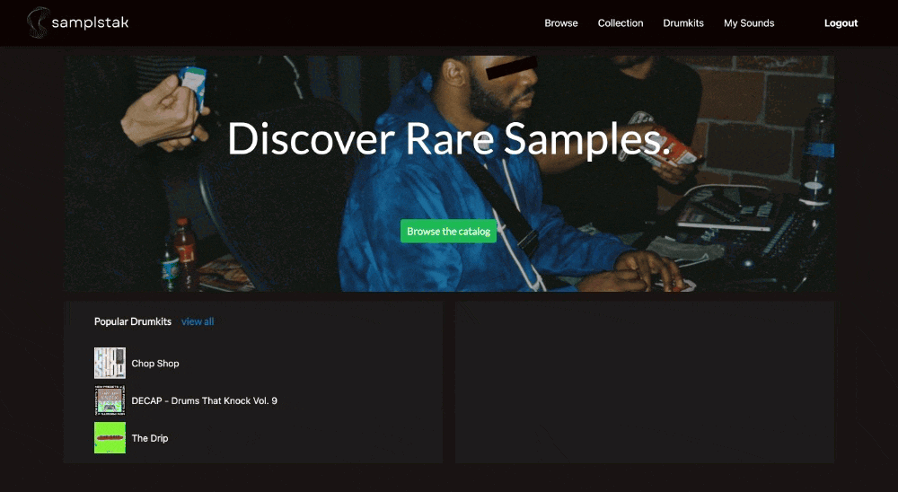
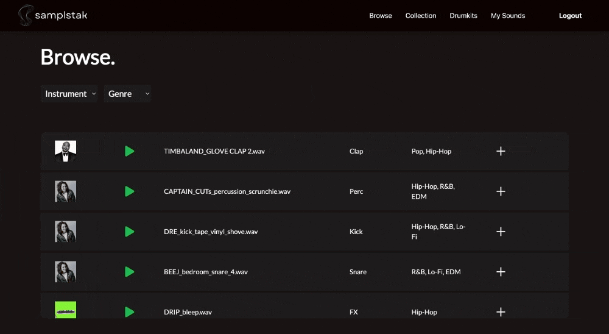
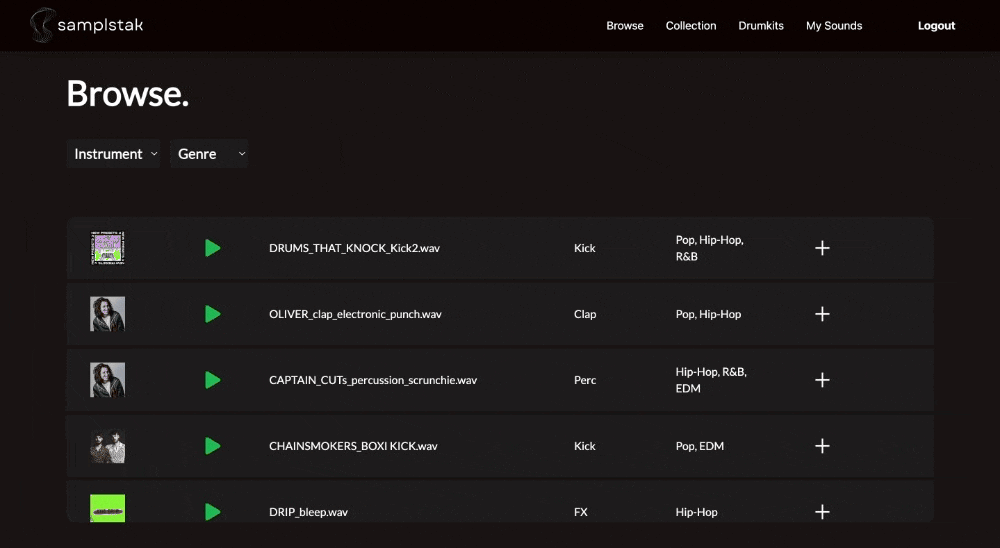
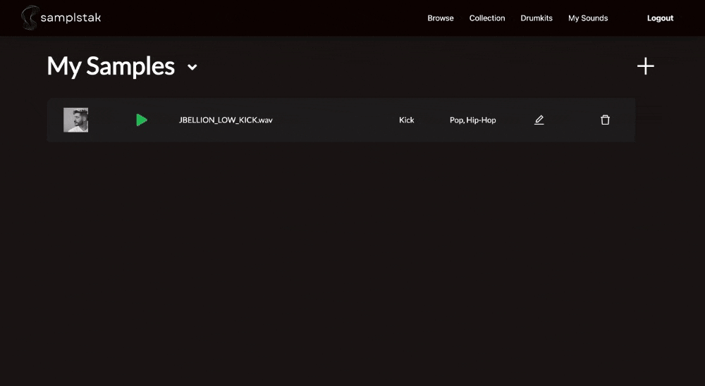

## SamplStak

---


### [Video Demo](https://www.loom.com/share/7ce29a209a524674a989752a16db0d98?sid=c94a1919-87d7-44ca-a290-4ca19fd0cfa9)

## Learning Goals

- Gain an understanding of how to use DRF FileField and ImageField to handle file and image uploads in a Django web application.
- Learn how to set up and configure DRF serializers to handle file/image uploads and handle data in complex formats.
- Gain an understanding of implementing CRUD (Create, Retrieve, Update, Delete) operations using DRF views and serializers.

## Features

SamplStak is a platform that offers music producers an intuitive and user-friendly way to manage their drum samples. The DRF server at the core of this platform provides powerful features that enable users to upload, manage, and share their samples with ease. With streamlined file uploads, dynamic filtering, and the ability to save favorite samples to a personal collection, users can easily find and share the perfect samples to elevate their productions. Users are able to manage their own sample and drumkit collections, allowing them to upload, edit, and delete their own samples and drumkits. These features provide users with a comprehensive and customizable platform that streamlines the process of music production.

## User Experience

---

#### User Login


---

#### Browse Samples



---

#### Add to Collection



---

#### Browse Drumkits



---

#### Create a Sample


---

#### Create a Drumkit



---

#### Create a Drumkit Sample


## Technologies Used

      

## Set Up

1. Clone this repo

   ```
   git clone git@github.com:nicholasvaldez/samplstak-server.git
   cd samplstak-server
   ```

2. Activate virtual environment

   ```
   pipenv shell
   ```

3. Install dependencies

   ```
   pipenv install
   ```

4. [Install Pillow](https://pillow.readthedocs.io/en/stable/installation.html)

5. Run the server

   ```
   python manage.py runserver
   ```

6. Finish installation by following the instructions found here:

<a href="https://github.com/nicholasvaldez/samplstak-client" target="_blank"></a>

## Nick Valdez

<a href="https://www.github.com/nicholasvaldez/" target="_blank"></a> <a href="https://www.linkedin.com/in/nicholasvaldez/" target="_blank"></a>
